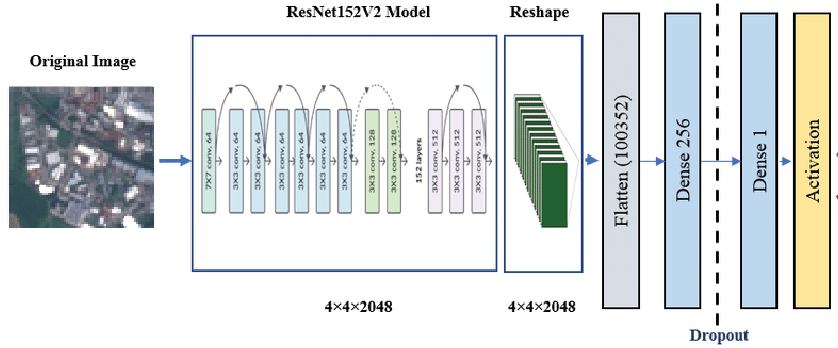

# Clasificador de Flores
## Introducción

En nuestro mundo hay una enorme cantidad de flores, de diferentes tamaños, formas y colores. Por eso, desarrollar un sistema 
que pueda reconocer algunas de ellas (sería demasiado reconocer todas) es una práctica interesante. En este repositorio se
hizo una practica sobre una red neuronal con CNN presicamente para esto, les hablare un poco de esto a continuacion.


## Los datos
Antes que nada, debo mencionar que saqué el dataset de [Kaggle](https://www.kaggle.com/datasets/utkarshsaxenadn/flower-classification-5-classes-roselilyetc). Este dataset está dividido en 3 carpetas: 
Train, Validation y Test. En este caso, tenemos 10 clases de flores:
- Daisy
- Lavender
- Rose
- Lily
- Sunflower
- Aster
- Iris
- Marigold
- Orchid
- Poppy

Cada una de las clases tiene 1500 imágenes de entrenamiento y 500 de validación.

## Preparacion de los datos.
Preparamos los datos de una forma simple. Solo reescalamos las imagenes a 256x256.
```python
train_gen = ImageDataGenerator(rescale=1/255., rotation_range=10, horizontal_flip=True)
valid_gen = ImageDataGenerator(rescale=1/255.)
test_gen = ImageDataGenerator(rescale=1/255)


train_dataset = train_gen.flow_from_directory("train", class_mode='binary', target_size=(256,256), shuffle=True, batch_size=32) 
valid_dataset = valid_gen.flow_from_directory("validation", class_mode='binary', target_size=(256,256), shuffle=True, batch_size=32) 
test_dataset  =  test_gen.flow_from_directory( "test", class_mode='binary', target_size=(256,256), shuffle=True, batch_size=32)
```
Aqui algunos ejemplos de las imagenes con las que vamos a entrenar:


## CNN
Como mencione, se uso una "Convolutional Neuronal Network", que tiene una estructura como esta:


## Transferencia de conocimiento
Desde una perspectiva arquitectónica, BiT no es más que una versión escalada 4 veces de ResNet152V2. 
La idea principal aquí es el Aprendizaje por Transferencia, este modelo está pre-entrenado en un conjunto de datos grande, 
por lo que puede ser entrenado en subconjuntos de datos o básicamente en otros conjuntos de datos pequeños y 
como el modelo está pre-entrenado en un conjunto de datos muy grande, se espera que tenga un rendimiento 
extremadamente bueno en el conjunto de datos pequeño. Hay 3 variantes de BiT:
- BiT-L: Esto se entrena en la tarea de clasificación de imágenes con 300 millones de muestras (esto es privado).
- BiT-M: Esto se entrena en la tarea de clasificación de imágenes con 14 millones de muestras.
- BiT-S: Esto se entrena en la tarea de clasificación de imágenes con 1,3 millones de muestras.

En este cuaderno, vamos a usar BiT-M.



## Construcción del modelo
Con la transferencia de aprendizaje esta parte del trabajo se facilito bastante. Solo agregamos una capa para que funcionara
con nuestros datos. Usamos la funcion de activacion **Softmax**
```python
model = Sequential([
    InputLayer(input_shape = (256,256,3)),
    bit,
    Dense(total_classes, activation = "softmax", kernel_initializer = "zeros")
], name = "Flower_Classification")
```


## Entrenamiento
Para entrenar usamos un learning rate muy bajo ya que lei que para el modelo de BiT da mejores resultados cuando esto es asi.
```python
learning_rate = 1e-3 #Con Bit, entre mas bajo el learning rate da mejores resultados.

#Optimizador
learningRate_sceduler = PiecewiseConstantDecay(
    boundaries = [200,300,400],
    values = [learning_rate*0.1, learning_rate*0.01, learning_rate*0.001, learning_rate*0.0001]
    
    model.compile(
    loss = "sparse_categorical_crossentropy",
    optimizer=optimizer,
    metrics=["accuracy"]
)
```
Entreamos con 15 epocas.
```python
history = model.fit(
    train_dataset,
    validation_data=valid_dataset,
    epochs = 15,
    callbacks=[
    ES(patience=6, restore_best_weights=True), MC("flower_classification"+".h5", save_best_only=True)
])
```
Y obtuvimos los siguientes resultados: loss: 0.3215 - accuracy: 0.9121 - val_loss: 0.2470 - val_accuracy: 0.9318


La pérdida disminuye continuamente y sorprendentemente, la pérdida de validación es mucho menor que la pérdida de entrenamiento. 
Tanto la precisión de validación como la de entrenamiento están muy cerca una de la otra. 
Esto demuestra la alta robustez del modelo.


## App Web
Para probar de una forma mas visual este modelo, desarrolle una aplicacion de web de deteccion. En un principio trate de usar
TensorFlow.js, pero tuve algunos problemas que no supe solucionar; a causa de esto decidi usar una biblioteca de Python llamada Streamlit que cumpliria con la tarea perfectamente. Aqui algunas imagenes de como funciona:


Esta App esta desarrollada en el archivo del repositorio **flower_prediction.py**.
Para poder correr la app se ocupan TensorFlow para cargar el modelo con Keras y Streamlit, este ultimo se puede instalar con pip. En la documentacion
se recomienda hacerlo con un enviroment.
```python
pip install streamlit
```
Una vez instaladas la libreria de TensorFlow y Streamlit podemos correr la appc con el comando:
```python
streamlit run flower_prediction.py
```

De igual manera aqui esta la [documentacion](https://docs.streamlit.io/library/get-started/installation) de streamlit sobre la instalacion.

## Conclusion.
Fue una practica divertida de hacer para practicar CNN. Ademas, se me hizo muy bueno desarrollar la pequeña aplicacion web 
para poder usar mi trabajo fuera de mi editor de codigo.
